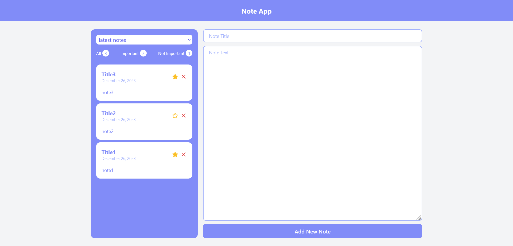

# Note App

## Table of contents

- [Overview](#overview)
- [How to run project](#how-to-run-project)
- [Screenshot](#screenshot)
- [Built with](#built-with)
- [What I learned](#what-i-learned)

### Overview

This is a mini project to learn basic concepts of react.
Add new note, delete a note and add a note to important notes.

### How to run project

- npm install
- npm run dev

### Screenshot



### Built with

- [React](https://reactjs.org/) - JS library
- [tailwind](https://tailwindcss.com/) - For styles
- [heroicons](https://heroicons.com/) - For svg

### What I learned

- How to make components
- How to use props, handle events and forms
- State management and How to use useState() and lifting state up
- How to use useReducer()
- How to sort data and render list in react

```js
function notesReducer(notes, { type, payload }) {
  switch (type) {
    case "addNote":
      return [...notes, payload];
    case "deleteNote":
      return notes.filter((note) => note.id !== payload);
    case "importantNote":
      return notes.map((note) =>
        note.id === payload ? { ...note, important: !note.important } : note
      );
    default:
      throw new Error("unknown error :" + type);
  }
}

const [notes, dispatch] = useReducer(notesReducer, []);

const handleAddNote = (newNote) =>
  dispatch({ type: "addNote", payload: newNote });

const handleDeleteNote = (id) => dispatch({ type: "deleteNote", payload: id });

const handleImportantNote = (id) =>
  dispatch({ type: "importantNote", payload: id });
```
